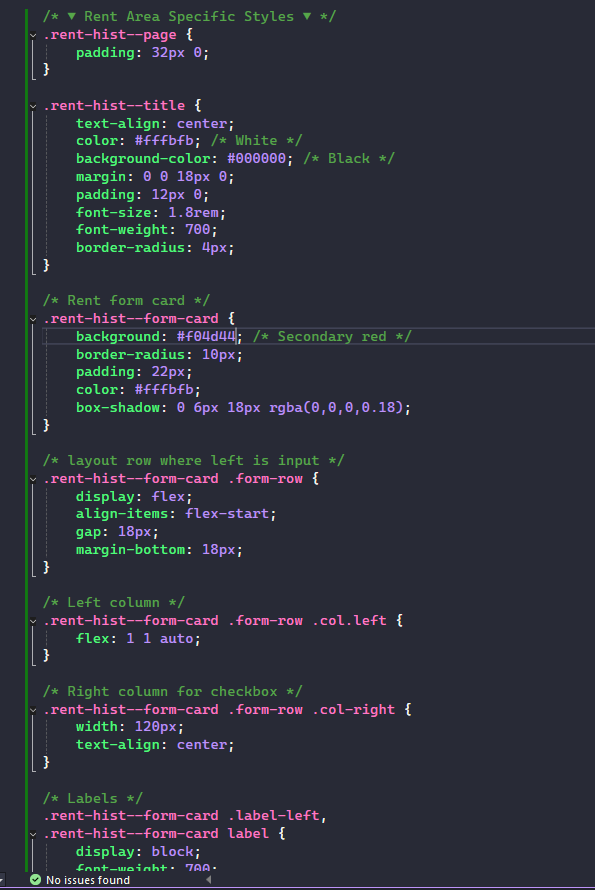
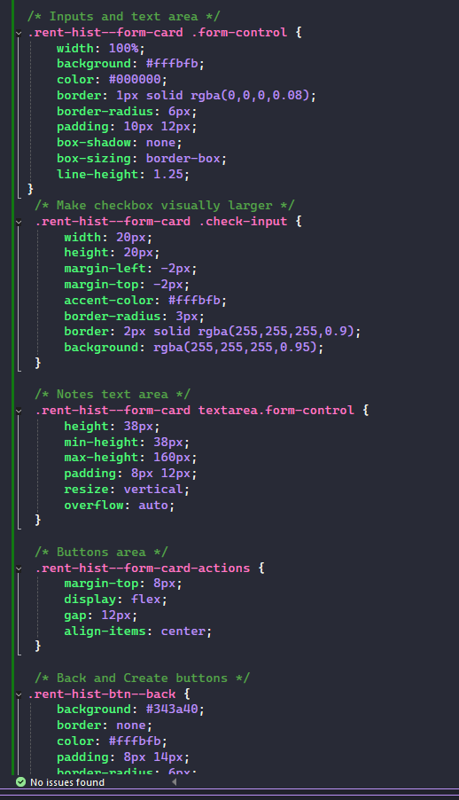
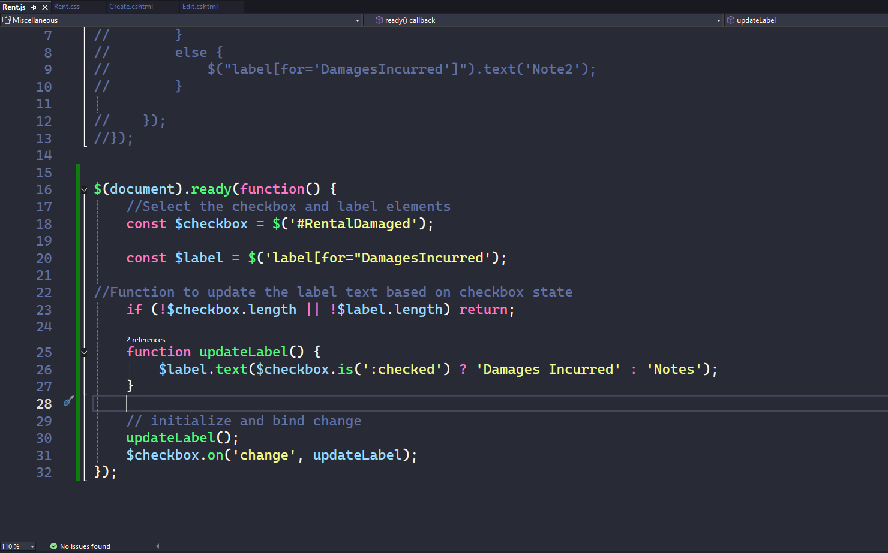
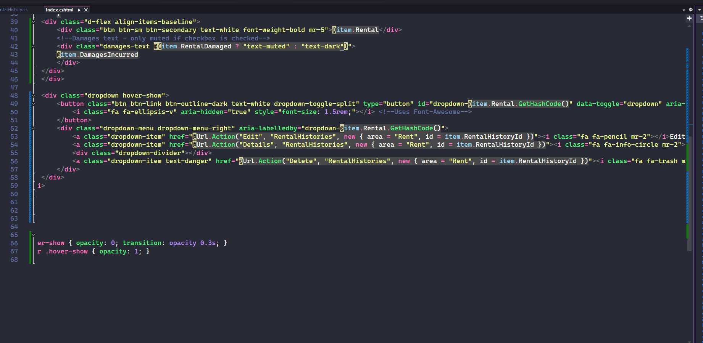

# Portfolio Projects

- This README is a collection of code snippets from live projects I have worked on. They include
descriptions of each snippet/screenshot about what the code was for.

## Snippets from live project TheaterCMS3

- This project was completed as part of my final assignment for my school: The Tech Academy, and it's parent
company: Prosper IT Solutions.

- It was for a coming live website for a theater company in Portland, Oregon. 
It was created using ASP.NET CORE in the MVC format.

### Code Snippets/Screenshots

#### Snippet 1: JavaScript Code for intro story into project

- This code is of JavaScript designed to dynamically update a displayed count of names (specifically, the number of parapragh tags) inside a container on a webpage. 
- It is particularly on what appears to be a "sign-in" or "home" page. 
- It ensures the count is updated at the appropriate time during page loading.

#### Snippet 2: C# code of controller for "Rental History" page

- Shows several action methods related to editing and deleting rental history records using Entity Framework for database operations.
- Handles the HTTP POST request when a user submits the Edit form.
- Protects against cross-site request forgery (CSRF) attacks.
- It binds only specific properties from the form data to prevent over-posting attacks.
- If the submitted model is valid: It Marks the entity as modified in the Entity Framework context.
- Saves changes to the database.
- Redirects to the Index action (typically a list view).

#### Snippet 3: C# code "RentalHistory" model class of database table entity

- Unique identifier (primary key) for each rental history record.
- Marked with [Key] attribute, which tells Entity Framework this is the primary key column in the database.
- A yes/no flag indicating whether the rented item was returned damaged.
- A text field to describe what damages occurred (e.g., "Torn sleeve, missing button").
- Stores the name or identifier of the item that was rented

#### Snippet 4 - 6: CSS styles for Create and Edit views 

- These snippets showcase the CSS styles applied to the Create and Edit views of the RentalHistory entity.
- They ensure a consistent and user-friendly layout, enhancing the overall user experience.

#### Snippet 7: jQuery code manipulating Damages Incurred label on Create page when Damaged box is checked

- This jQuery code dynamically updates the label for the "Damages Incurred" field based on the state of the "Rental Damaged" checkbox.

#### Snippet 8 - 9: HTML employing Bootstrap and jQuery to style the Index view for RentalHistories

- This is a Razor Page view (Index.cshtml) for displaying a list of Rental Histories in an ASP.NET Core application using Bootstrap 4 (evident from classes like mr-, btn-sm, etc.).
- The page shows a list of recent rental history items in a clean, card-based layout.
- It utilizes jQuery for dynamic interactions and enhancements.
- Rows have a custom class hover-row to show action menus like ellipsis on hover.
- Standard Bootstrap 4 styling for consistency
- It's well-structured, maintainable, and follows common patterns for admin/dashboard lists in ASP.NET Core Razor Pages. The only minor note is the empty select tag is set up for future sorting options, not actually implemented.

