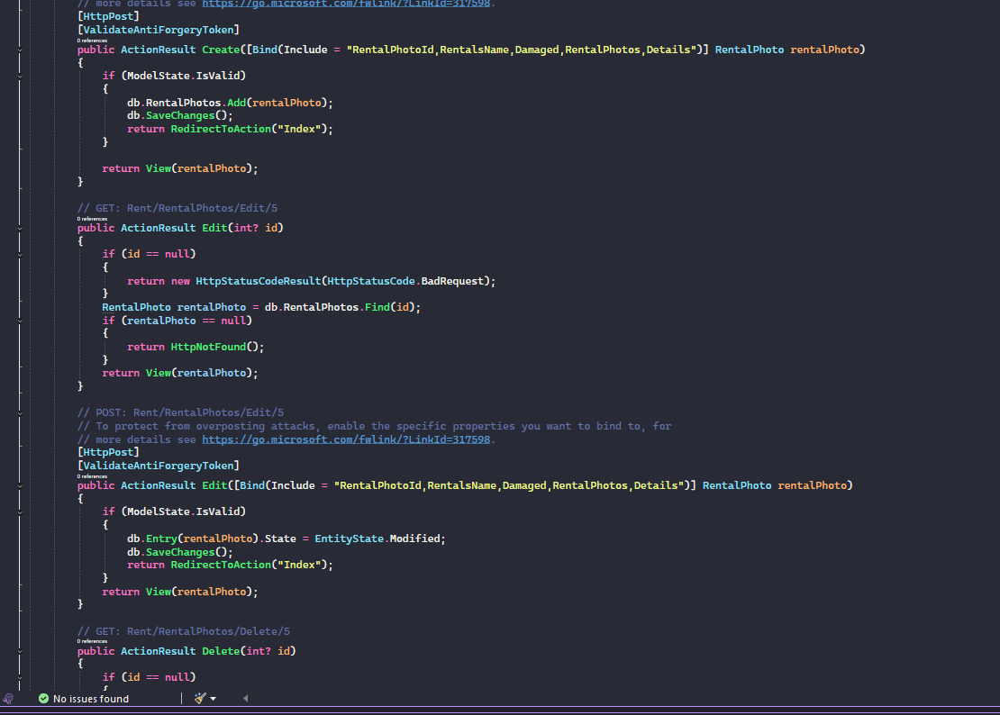
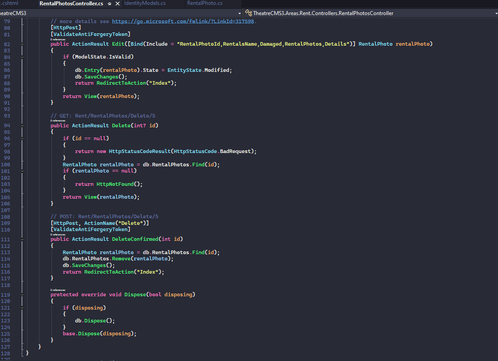
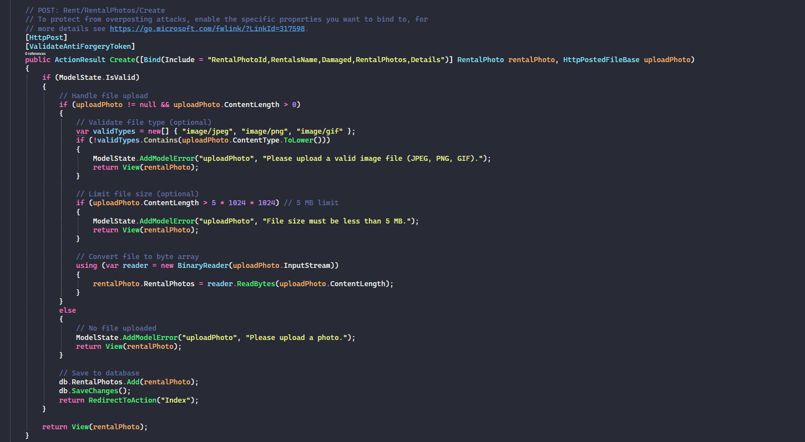
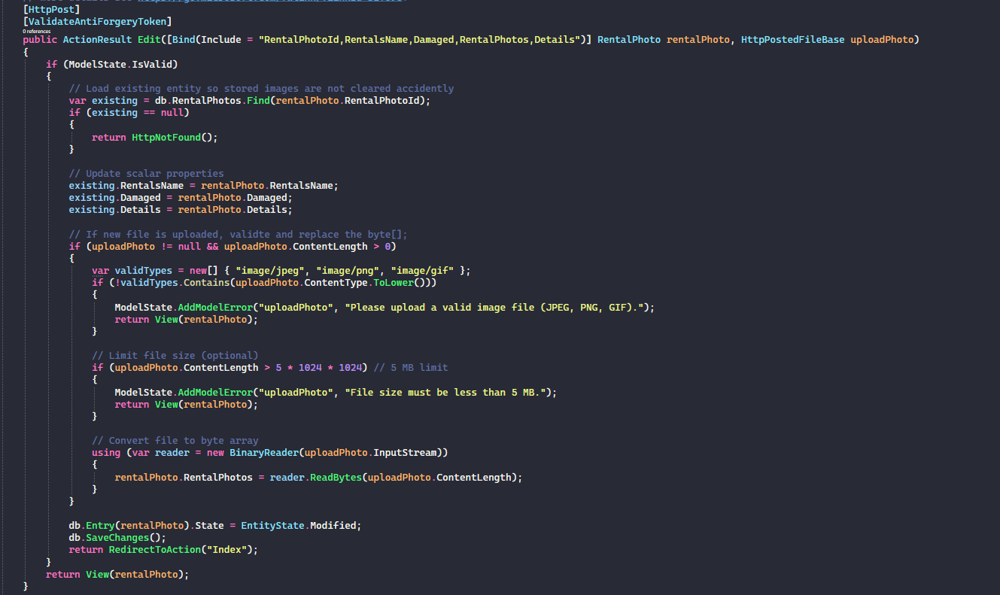

# Portfolio Projects

- This README is a collection of code snippets from live projects I have worked on. They include
descriptions of each snippet/screenshot about what the code was for.

## Snippets from live project TheaterCMS3

- This project was completed as part of my final assignment for my school: The Tech Academy, and it's parent
company: Prosper IT Solutions.

- It was for a coming live website for a theater company in Portland, Oregon. 
It was created using ASP.NET CORE in the MVC format.

### Code Snippets/Screenshots

#### Snippet 1: JavaScript Code for intro story into project

- This code is of JavaScript designed to dynamically update a displayed count of names (specifically, the number of parapragh tags) inside a container on a webpage. 
- It is particularly on what appears to be a "sign-in" or "home" page. 
- It ensures the count is updated at the appropriate time during page loading.

#### Snippet 2: C# code of controller for "Rental History" page

- Shows several action methods related to editing and deleting rental history records using Entity Framework for database operations.
- Handles the HTTP POST request when a user submits the Edit form.
- Protects against cross-site request forgery (CSRF) attacks.
- It binds only specific properties from the form data to prevent over-posting attacks.
- If the submitted model is valid: It Marks the entity as modified in the Entity Framework context.
- Saves changes to the database.
- Redirects to the Index action (typically a list view).

#### Snippet 3: C# code "RentalHistory" model class of database table entity

- Unique identifier (primary key) for each rental history record.
- Marked with [Key] attribute, which tells Entity Framework this is the primary key column in the database.
- A yes/no flag indicating whether the rented item was returned damaged.
- A text field to describe what damages occurred (e.g., "Torn sleeve, missing button").
- Stores the name or identifier of the item that was rented

#### Snippet 4 - 6: CSS styles for Create and Edit views 

- These snippets showcase the CSS styles applied to the Create and Edit views of the RentalHistory entity.
- They ensure a consistent and user-friendly layout, enhancing the overall user experience.

#### Snippet 7: jQuery code manipulating Damages Incurred label on Create page when Damaged box is checked

- This jQuery code dynamically updates the label for the "Damages Incurred" field based on the state of the "Rental Damaged" checkbox.

#### Snippet 8 - 9: HTML employing Bootstrap and jQuery to style the Index view for RentalHistories

- This is a Razor Page view (Index.cshtml) for displaying a list of Rental Histories in an ASP.NET Core application using Bootstrap 4 (evident from classes like mr-, btn-sm, etc.).
- The page shows a list of recent rental history items in a clean, card-based layout.
- It utilizes jQuery for dynamic interactions and enhancements.
- Rows have a custom class hover-row to show action menus like ellipsis on hover.
- Standard Bootstrap 4 styling for consistency
- It's well-structured, maintainable, and follows common patterns for admin/dashboard lists in ASP.NET Core Razor Pages. The only minor note is the empty select tag is set up for future sorting options, not actually implemented.

#### Snippet 10: jQuery code to give sorting functionality on Index view

- This JavaScript/jQuery code implements client-side sorting for the list on the Index page. It allows users to reorder the visible list items instantly (without a page refresh) based on selections from the "Sorted by" dropdown (#sort).

#### Snippets 11 - 14: Controller w/ scaffolding and Entity Model for database

- This C# code snippet is from an ASP.NET Core MVC controller named RentalPhotosController, for a content management system for a theater.
- It's located in the Areas.Rent.Controllers namespace, indicating it's organized under an "Rent" area for modular routing (e.g., URLs like /Rent/RentalPhotos).
- The controller handles CRUD (Create, Read, Update, Delete) operations for entities related to "Rental Photos".

- The other snippet is of code that defines an Entity Framework (EF) model class named RentalPhoto within the TheatreCMS3.Areas.Rent.Models namespace.
- This class represents a database entity for storing information about photos related to rented items (e.g., props, costumes, or rooms), likely for documenting conditions like damage during rentals.
- The model is designed for use with Entity Framework (likely EF6 or EF Core, based on the attributes), mapping to a SQL table named "RentalPhotos".

#### Snippets 15 - 19: Controller method for image uploadand converts to byte, uses photo ID to retrieve. File input field in CRUD pages

- This code snippet is the POST Create action in an ASP.NET MVC 5 project (classic MVC, not Core).
- It handles form submission for creating a new RentalPhoto record, with the key feature being proper handling of an uploaded image file, converting it to a byte[] for storage in the database.

- The next code snippet is a well-structured POST Edit action in the RentalPhotosController (ASP.NET MVC 5) that safely handles photo updates during editing.
- It first loads the existing RentalPhoto entity from the database to preserve the current image bytes if no new file is uploaded, preventing accidental overwriting with null.
- It then updates scalar properties (name, damaged status, details) from the posted model.
- When a new photo is provided via HttpPostedFileBase uploadPhoto, it performs robust validation—checking for valid image MIME types (JPEG, PNG, GIF) and enforcing a 5 MB size limit—before converting the uploaded file stream to a byte[] using BinaryReader.

- After that, This code defines a dedicated Photo action in the RentalPhotosController (ASP.NET MVC 5) to securely serve stored image data as a file response.
- It retrieves a RentalPhoto entity by ID, returns a 404 if not found, and a 204 No Content if the image byte array is null or empty.
- For valid image data, it determines the correct MIME type by inspecting the byte array's magic numbers (file signature).

- The last two snippets following represents a standard Bootstrap-formatted file upload input field within a form group, typically used in an ASP.NET MVC view (e.g., Create or Edit pages for the RentalPhoto model).
- It features a label styled with custom-control-label and Bootstrap grid classes (col-md-2) for alignment, paired with a file input in a col-md-10 column.
- The input type="file" element is named "uploadPhoto" to match the corresponding HttpPostedFileBase parameter in the controller, restricts uploads to image files via accept="image/*", and is marked as required to enforce selection.
- The last snippet also conditionally displays the current uploaded photo while providing an upload field for a new one.

